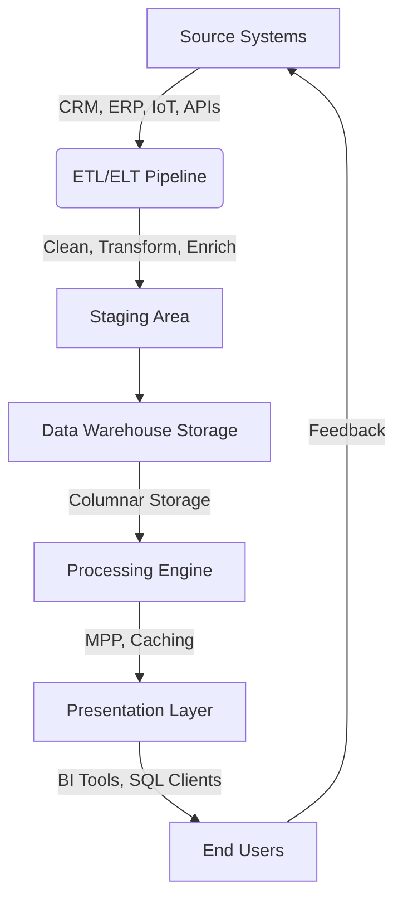

# Data Warehousing 101: The Engine Behind Modern Analytics  

---
## Table of Contents  
1. [Introduction](#1-introduction)  
2. [What is a Data Warehouse?](#2-what-is-a-data-warehouse)  
   - [Definition](#definition)  
   - [Core Characteristics](#core-characteristics)  
   - [Data Warehouse vs. Alternatives](#data-warehouse-vs-alternatives)  
3. [Architecture of a Data Warehouse](#3-architecture-of-a-data-warehouse)  
   - [End-to-End Workflow](#end-to-end-workflow)  
   - [Key Components Explained](#key-components-explained)  
4. [Benefits & Challenges](#4-benefits--challenges)  
   - [Benefits](#benefits)  
   - [Challenges](#challenges)  
5. [Types of Data Warehouses](#5-types-of-data-warehouses)  
6. [Popular Tools Compared](#6-popular-tools-compared)  
7. [Real-World Use Cases](#7-real-world-use-cases)  
   - [Case Study 1: Retail Analytics](#case-study-1-retail-analytics)  
   - [Case Study 2: Healthcare Analytics](#case-study-2-healthcare-analytics)  
8. [Building a Data Warehouse: Step-by-Step](#8-building-a-data-warehouse-step-by-step)  
9. [Future Trends](#9-future-trends)  
10. [Conclusion](#10-conclusion)  

---

## 1. Introduction    
In our journey through the Data Engineering Series, we’ve built a robust foundation:  
- **Data Storage** (03/02): Explored databases, data lakes, and distributed file systems.  
- **ETL Pipelines** (20/01, 27/01): Mastered extracting, transforming, and loading data.  

Today, we bridge these concepts with **data warehousing**—a system that transforms raw data into actionable insights. Imagine a global retailer like *Amazon* analyzing decades of sales data to predict holiday demand. Transactional databases handle daily operations, but answering strategic questions requires a **data warehouse**: a purpose-built engine for analytics.  

---

## 2. What is a Data Warehouse?  
### Definition  
A data warehouse (DWH) is a **centralized repository** for structured, historical data, optimized for analytical queries (OLAP). Unlike transactional databases (OLTP), it prioritizes read-heavy operations like aggregations, joins, and trend analysis.  

### Core Characteristics  
| **Trait**              | **Description**                                                                 | **Example**                                      |  
|-------------------------|---------------------------------------------------------------------------------|--------------------------------------------------|  
| **Subject-Oriented**    | Organized around business domains (sales, finance).                            | A "Sales" subject area includes revenue, products, regions. |  
| **Integrated**          | Merges data from disparate sources (CRM, IoT, spreadsheets) into a unified format. | Converting regional date formats (MM/DD/YYYY vs. DD/MM/YYYY) to a global standard. |  
| **Time-Variant**        | Tracks data changes over time (daily, monthly snapshots).                       | Storing quarterly sales data for 10+ years.      |  
| **Non-Volatile**        | Data is never modified or deleted—only appended or refreshed.                  | Historical sales records remain immutable for auditing. |  

### Data Warehouse vs. Alternatives  
| **System**          | **Structure**       | **Use Case**                          | **Example Tools**          |  
|----------------------|----------------------|---------------------------------------|-----------------------------|  
| **OLTP Database**    | Row-oriented, normalized | Real-time transactions (e.g., e-commerce orders). | MySQL, PostgreSQL.          |  
| **Data Lake**        | Raw, unstructured    | Storing diverse data (logs, images).  | AWS S3, Hadoop.             |  
| **Data Warehouse**   | Columnar, structured | Analytical queries (e.g., yearly revenue trends). | Redshift, BigQuery.         |  
| **Lakehouse**        | Hybrid (raw + structured) | Combining analytics on raw and processed data. | Databricks Delta Lake.      |  

---

## 3. Architecture of a Data Warehouse  
### End-to-End Workflow  

### Key Components Explained  
1. **Source Systems**:  
   - **Transactional Databases**: OLTP systems (e.g., PostgreSQL) storing real-time operational data.  
   - **External Data**: APIs (weather data), SaaS tools (Salesforce), IoT sensors.  
   - **Legacy Systems**: Mainframes or flat files (CSVs) requiring migration.  

2. **ETL/ELT Pipeline**:  
   - **ETL**:  
     - *Extract*: Pull data from sources.  
     - *Transform*: Clean, deduplicate, and standardize (e.g., convert currencies).  
     - *Load*: Write processed data to the warehouse.  
     - *Tools*: Apache Airflow, Talend, Informatica.  
   - **ELT**:  
     - Modern approach for cloud warehouses (e.g., Snowflake).  
     - Load raw data first, then transform using SQL/Python within the warehouse.  

3. **Staging Area**:  
   - Temporary storage for raw data before transformation.  
   - Ensures idempotency (re-running pipelines doesn’t duplicate data).  

4. **Storage Layer**:  
   - **Columnar Storage**: Stores data by columns (not rows), optimizing I/O for analytics.  
     - *Example*: Parquet files reduce storage costs and speed up `SUM(sales)` queries.  
   - **Partitioning**: Splits data by time (e.g., `year=2023/month=12`) for faster queries.  
   - **Compression**: Algorithms like Snappy reduce storage footprint.  

5. **Processing Layer**:  
   - **Massively Parallel Processing (MPP)**: Distributes queries across clusters (e.g., Redshift).  
   - **Query Optimization**: Cost-based optimizers choose efficient execution plans.  
   - **Caching**: Frequent queries (e.g., daily revenue) are cached for instant results.  

6. **Presentation Layer**:  
   - **BI Tools**: Tableau, Power BI, Looker for drag-and-drop dashboards.  
   - **Ad-Hoc SQL**: Analysts run custom queries via JDBC/ODBC connectors.  
   - **APIs**: Expose warehouse data to applications (e.g., recommendation engines).  

---

## 4. Benefits & Challenges  
### Benefits  
1. **Performance**:  
   - Columnar storage and MPP enable sub-second responses for complex queries.  
   - *Example*: A telecom company aggregates 1B rows to analyze call drop rates by region.  

2. **Unified View**:  
   - Break down silos by integrating sales, marketing, and supply chain data.  
   - *Example*: Correlating ad spend (from Google Ads) with sales data (from SAP).  

3. **Historical Analysis**:  
   - Track metrics over time (e.g., YoY revenue growth, customer churn trends).  
   - *Example*: A bank detects fraud by comparing transaction patterns across 5 years.  

4. **Scalability**:  
   - Cloud warehouses (BigQuery, Snowflake) scale compute and storage independently.  
   - *Example*: A startup scales from 100 GB to 100 TB without infrastructure changes.  

### Challenges  
1. **ETL Complexity**:  
   - Integrating messy, inconsistent data sources (e.g., merging legacy CRM with modern SaaS tools).  
   - *Solution*: Use data quality tools (Great Expectations) and schema validation.  

2. **Cost Management**:  
   - Cloud warehouses charge for storage + compute + data transfer.  
   - *Best Practice*: Auto-pause clusters during off-peak hours (Redshift) or use serverless (BigQuery).  

3. **Security & Governance**:  
   - Ensuring GDPR/HIPAA compliance in multi-source environments.  
   - *Solution*: Role-based access control (RBAC) and data masking.  

4. **Performance Tuning**:  
   - Poorly designed schemas or queries can cripple performance.  
   - *Example*: A `SELECT *` on a 100-column table wastes I/O.  
   - *Solution*: Use query profiling tools (Snowflake Query History) and indexing.  

---

## 5. Types of Data Warehouses  
1. **Enterprise Data Warehouse (EDW)**:  
   - Centralized repository for organization-wide analytics (e.g., Walmart’s global sales data).  
   - *Tools*: Teradata, Oracle Exadata.  

2. **Data Mart**:  
   - Subset of an EDW, focused on a department (e.g., *Finance Data Mart* for budgeting).  
   - *Tools*: Microsoft Analysis Services.  

3. **Operational Data Store (ODS)**:  
   - Real-time data for operational reporting (e.g., daily inventory levels).  
   - *Tools*: PostgreSQL, MongoDB.  

4. **Cloud Data Warehouse**:  
   - Fully managed, scalable solutions (e.g., Snowflake, BigQuery).  
   - *Advantage*: No hardware provisioning; pay-as-you-go pricing.  

---

## 6. Popular Tools Compared  
| **Tool**            | **Strengths**                                   | **Limitations**                          | **Pricing Model**          |  
|----------------------|-------------------------------------------------|------------------------------------------|-----------------------------|  
| **Amazon Redshift**  | Tight AWS integration, MPP.                    | Manual cluster scaling.                  | Hourly (provisioned).       |  
| **Google BigQuery**  | Serverless, built-in ML.                       | Limited control over infrastructure.     | Pay-per-query + storage.    |  
| **Snowflake**        | Multi-cloud, near-zero maintenance.            | Higher cost for small workloads.         | Credits (compute + storage).|  
| **Azure Synapse**    | Integration with Power BI, Spark support.      | Steep learning curve for non-Microsoft users. | Pay-as-you-go. |  

---

## 7. Real-World Use Cases  
### Case Study 1: Retail Analytics  
- **Company**: Target.  
- **Goal**: Optimize inventory for holiday seasons.  
- **Solution**:  
  1. Ingest sales data from POS systems, e-commerce platforms, and suppliers.  
  2. Build a warehouse with partitioned tables (by region, product category).  
  3. Use Tableau to visualize sales trends and predict stock requirements.  
- **Outcome**: 20% reduction in overstocking costs.  

### Case Study 2: Healthcare Analytics  
- **Company**: Mayo Clinic.  
- **Goal**: Reduce patient readmission rates.  
- **Solution**:  
  1. Integrate EHR (Electronic Health Records), lab results, and insurance data.  
  2. Train ML models in BigQuery to identify high-risk patients.  
  3. Alert doctors via dashboards for proactive care.  
- **Outcome**: 15% decrease in 30-day readmissions.  

---

## 8. Building a Data Warehouse: Step-by-Step  
1. **Requirement Gathering**:  
   - Interview stakeholders (e.g., "Which metrics do executives need?").  
   - Define KPIs: Revenue, CAC (Customer Acquisition Cost), churn rate.  

2. **Schema Design**:  
   - **Star Schema**: Fact tables (e.g., `sales_fact`) linked to dimension tables (e.g., `product_dim`, `time_dim`).  
   - **Snowflake Schema**: Normalized dimensions for storage efficiency.  

3. **ETL Development**:  
   - Use Airflow to orchestrate pipelines.  
   - Validate data with dbt (data build tool).  

4. **Deployment**:  
   - Choose a cloud warehouse (e.g., Snowflake).  
   - Migrate data and configure RBAC.  

5. **Optimization**:  
   - Partition tables by date.  
   - Materialize frequently queried views.  

---

## 9. Future Trends  
1. **Real-Time Warehousing**:  
   - Tools like **Apache Kafka** + **Materialize** enable streaming analytics.  
   - *Example*: Uber updates driver ETA calculations in real time.  

2. **AI-Driven Warehouses**:  
   - **Automated Optimization**: Snowflake’s auto-clustering and BigQuery’s BI Engine.  
   - **In-Warehouse ML**: Train models without moving data (e.g., Redshift ML).  

3. **Data Mesh**:  
   - Decentralize ownership (e.g., domain-specific teams manage their data products).  
   - *Tools*: Starburst Galaxy for federated queries.  

4. **Greenfield Warehousing**:  
   - Startups adopt serverless tools (BigQuery) to skip infrastructure setup.  

---

## 10. Conclusion  
Data warehousing is the backbone of modern analytics, turning fragmented data into strategic assets. By mastering ETL pipelines (as covered earlier) and leveraging cloud tools, engineers can build systems that drive decisions—from optimizing supply chains to personalizing customer experiences.  
