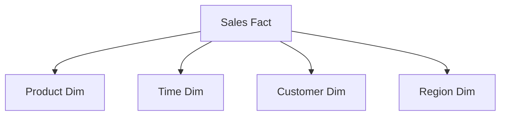
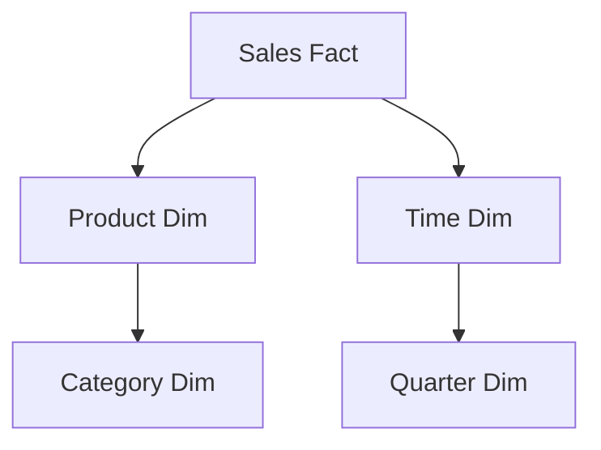

# **Data Modeling 101: Designing Efficient Data Warehouses**  

---

## **Table of Contents**  
1. [Introduction](#1-introduction)  
2. [What is Data Modeling?](#2-what-is-data-modeling)  
3. [Types of Data Models](#3-types-of-data-models)  
   - [Star Schema](#star-schema)  
   - [Snowflake Schema](#snowflake-schema)  
   - [When to Use Hybrid Approaches](#when-to-use-hybrid-approaches)  
   - [Slowly Changing Dimensions (SCDs)](#slowly-changing-dimensions-scds)  
4. [Normalization vs. Denormalization](#4-normalization-vs-denormalization)  
   - [Performance Considerations](#performance-considerations)  
5. [Future Trends in Data Modeling](#5-future-trends-in-data-modeling)  
6. [Conclusion](#6-conclusion)  

---

## **1. Introduction**  
In our last article, we explored how data warehouses serve as the backbone of modern analytics. But a warehouse is only as powerful as its **data model**—the blueprint that defines how data is stored, organized, and accessed. Poor modeling leads to slow queries, inconsistent insights, and frustrated users.  

Today, we dive into **data modeling for warehouses**, covering:  
✅ **Star schemas** vs. **Snowflake schemas**  
✅ **Slowly Changing Dimensions (SCDs)**  
✅ **Normalization vs. Denormalization**  
✅ Tools and best practices for scalable design.  

---

## **2. What is Data Modeling?**  
### **Definition**  
Data modeling is the process of designing **logical and physical structures** for data to ensure efficient storage, retrieval, and analysis. For warehouses, it focuses on optimizing for **analytical workloads** (OLAP) rather than transactions (OLTP).  

### **Key Principles**  
1. **Simplicity**: Models should balance performance and usability.  
2. **Scalability**: Adapt to growing data volumes without redesign.  
3. **Query Efficiency**: Optimize for aggregations and joins.  
4. **Business Alignment**: Reflect how users analyze data (e.g., by region, product, time).  

---

## **3. Types of Data Models**  
### **Star Schema**  
- **Structure**: A central **fact table** (e.g., `sales_fact`) linked to **dimension tables** (e.g., `product_dim`, `time_dim`).  
- **Pros**: Simple, fast queries, ideal for BI tools.  
- **Cons**: Redundant data (denormalized dimensions).  

### **Snowflake Schema**  
- **Structure**: Normalized dimensions (e.g., `product_dim` → `category_dim`).  
- **Pros**: Reduces redundancy, saves storage.  
- **Cons**: Complex joins, slower queries.  

### **When to Use Hybrid Approaches**  
Hybrid models (partially denormalized schemas) can provide a balance:  
- Denormalize frequently accessed dimensions while keeping others normalized.  
- Use **bridge tables** to handle many-to-many relationships efficiently.  

### **Slowly Changing Dimensions (SCDs)**  
Handles changes in dimension data over time (e.g., customer address updates).  

| **Type** | **Description** | **Example** |
|----------|---------------|-------------|
| **Type 1** | Overwrite old data. | Customer’s incorrect phone number is updated. |
| **Type 2** | Add new row with versioning. | Tracking employee role changes with `start_date` and `end_date`. |
| **Type 3** | Add columns for limited history. | Storing current and previous manager IDs. |

---

## **4. Normalization vs. Denormalization**  
| **Aspect** | **Normalization** | **Denormalization** |
|-----------|------------------|------------------|
| **Structure** | Minimal redundancy (3NF). | Redundant data for faster reads. |
| **Use Case** | OLTP systems (e.g., ERP). | OLAP systems (e.g., data warehouses). |
| **Pros** | Saves storage, ensures integrity. | Faster queries, simpler joins. |
| **Cons** | Complex joins, slower queries. | Higher storage costs. |

### **Performance Considerations**  
- **Materialized Views vs. Indexes**: Materialized views precompute aggregations, while indexes speed up lookups.  
- **Columnar Storage (Parquet, ORC)**: Optimized for analytical queries.  
- **Partitioning Strategies**: Improves performance in distributed systems like Snowflake and Redshift.  

---

## **5. Future Trends in Data Modeling**  
1. **Automated Modeling**:  
   - Tools like **Datafold** and **Great Expectations** auto-suggest optimizations.  
2. **AI-Driven Modeling**:  
   - GPT-4 generates SQL models from natural language prompts.  
3. **Data Vault 2.0**:  
   - Hybrid approach with **hub, link, and satellite tables**, enabling agility and auditability.  
4. **Semantic Layers**:  
   - Tools like **LookML** and **AtScale** decouple logic from storage.  

---

## **6. Conclusion**  
Data modeling transforms raw warehouses into engines of insight. By choosing the right schema, handling SCDs, and balancing normalization, you unlock speed, clarity, and scalability.  

---

